# Forecasting Alberta Electricity Pool Price Changes: LSTM vs. ARIMA vs. LASSO

**GitHub Repository:** https://github.com/Oprixion/Time-Series-Forcasting_LSTM  
**Course:** STAT 607  
**Date:** April 6, 2026

---

## Table of Contents
1. [Background & Introduction](#1-background--introduction)
2. [Data Source](#2-data-source)
3. [Preliminary Analyses (EDA)](#3-preliminary-analyses-eda)
4. [Statistical Hypotheses & Problem Statement](#4-statistical-hypotheses--problem-statement)
5. [Formal Analyses](#5-formal-analyses)
6. [Interpretation of Results](#6-interpretation-of-results)
7. [Conclusions](#7-conclusions)
8. [Task Division](#8-task-division)

---

## 1. Background & Introduction

Alberta's electricity market operates under the **System Marginal Price (SMP) pool pricing** model administered by the Alberta Electric System Operator (AESO). Unlike regulated markets, Alberta's deregulated wholesale electricity price is determined hourly by the merit-order dispatch of generators, making it uniquely volatile and sensitive to weather- and demand-driven shocks. Prices can legally spike to the regulated cap of \$1,000/MWh during scarcity events and drop near \$0 during periods of high renewable output.

The **practical motivation** for forecasting hourly price changes is significant:
- **Retailers and industrial consumers** hedge electricity costs and adjust load schedules.
- **Generators** optimize bid strategies and maintenance windows.
- **Grid operators** anticipate stress events to pre-position reserves.

This project focuses on forecasting **`delta_price`** — the hourly absolute change in the SMP pool price (\$/MWh) — rather than the raw price level. Forecasting the *change* is arguably more useful for short-term operational decisions and is a harder problem because `delta_price` exhibits heavy tails, near-zero autocorrelation at most lags, and episodic extreme spikes driven by identifiable weather events (cold snaps, low-wind periods).

Three modelling approaches of increasing complexity are compared:
1. **ARIMA(1,0,1)** — univariate time-series baseline capturing autocorrelation structure.
2. **LASSO Regression** — sparse linear model incorporating engineered weather and demand features.
3. **LSTM (Long Short-Term Memory)** — deep learning model exploiting 48-hour sequential patterns across all features.

---

## 2. Data Source

### 2.1 Energy Data — AESO Hourly Pool Price & AIL
- **Source:** Alberta Electric System Operator (AESO) — publicly available historical market data.
- **File:** `Hourly_Metered_Volumes_and_Pool_Price_and_AIL_2020-Jul2025.csv`
- **Period Covered:** January 2020 – July 2025 (hourly resolution, ~47,500 rows before cleaning)
- **Key columns retained:**
  - `ACTUAL_POOL_PRICE` — hourly SMP pool price \($/MWh), the primary target variable
  - `ACTUAL_AIL` — Alberta Internal Load (MW), the province-wide demand measure
  - Inter-provincial imports (`IMPORT_BC`, `IMPORT_MT`, `IMPORT_SK`) — dropped in feature engineering as shown below

### 2.2 Weather Data — NASA POWER
- **Source:** NASA Prediction Of Worldwide Energy Resources (POWER) API — open-access climate reanalysis.
- **File:** `alberta_weather_2020_2025.csv`
- **Stations:** Edmonton, Calgary, Lethbridge (provincial coverage)
- **Variables:** 2-metre temperature (T2M), 10m/50m wind speed (WS10M, WS50M), relative humidity (RH2M), global horizontal irradiance (GHI)

### 2.3 Data Cleaning Pipeline (`prepare_dataset.py`)

The full feature-engineering pipeline comprises 10 stages:

| Stage | Action |
|-------|--------|
| 1 | Load & filter AESO energy data to province-level columns |
| 2 | Load NASA POWER weather data; remap DST spring-forward timestamps |
| 3 | Left-join energy onto weather on local timestamp |
| 4 | Forward/back-fill weather NaNs; average DST fall-back duplicate rows |
| 5 | Drop 20 redundant weather/import columns; retain `T2M_AVG` and `WS50M_AVG` |
| 6 | Add price lag features: `price_lag_1` (t−1), `price_lag_24` (t−24), `price_lag_168` (t−168), `price_rolling_std_24` |
| 7 | Engineer model features: `wind_power_proxy` (WS³), `is_low_wind` (WS < 4 m/s), `is_cold_snap` (T < −20°C), `T2M_sq`, `AIL_T2M` interaction |
| 8 | Define target: `delta_price = ACTUAL_POOL_PRICE(t) − price_lag_1` |
| 9 | Add cyclical time encodings: `hour_sin/cos`, `dow_sin/cos`, `month_sin/cos` |
| 10 | Chronological 80/20 train/test split → `train.csv`, `test.csv` |

The DST spring-forward correction is particularly important: NASA POWER uses true MST (no DST offset), so it records a row at 02:00 on spring-forward Sundays that AESO skips; these rows are remapped to 03:00 to maintain join integrity. The final dataset contains **17 input features** plus the `delta_price` target.

---

## 3. Preliminary Analyses (EDA)

### 3.1 Distribution of SMP Pool Price and Delta Price

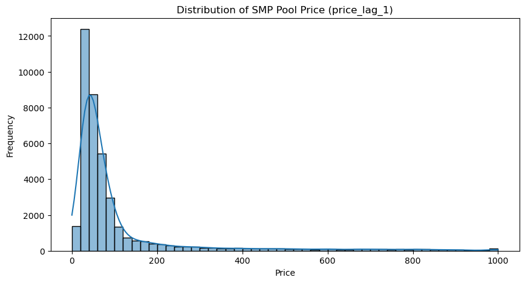

The SMP pool price (`price_lag_1`) is **heavily right-skewed**: the majority of prices cluster between \$20–\$80/MWh with a long tail extending to the \$1,000/MWh market cap. This non-Gaussian shape motivates modelling the hourly *change* rather than forecasting price levels directly.

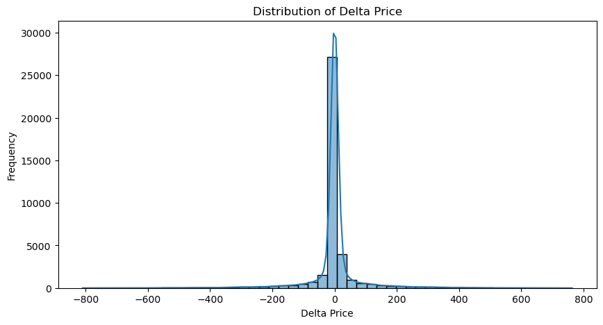

`delta_price` is **near-symmetric and extremely heavy-tailed**. The vast majority of hourly changes are within ±50 \$/MWh, but the distribution has significant mass beyond ±200 \$/MWh, reflecting the episodic price spikes characteristic of Alberta's deregulated market.

---

### 3.2 Seasonality Analysis

#### Hourly Pattern
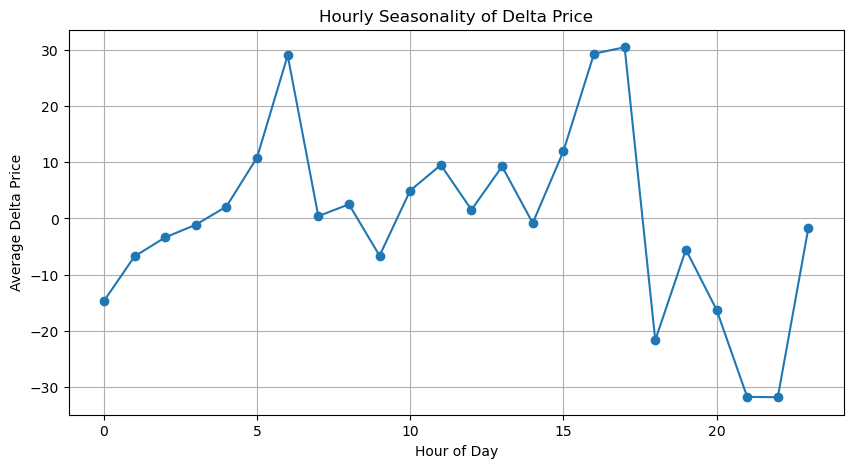

Delta price follows a clear **intra-day pattern**: prices tend to rise sharply in the early morning (hours 5–6) corresponding to morning demand ramp-up, peak again in the late afternoon (hours 16–17) during the evening demand peak, then fall during late evening and overnight hours (18–23). This dual-peak shape mirrors Alberta's typical residential and commercial load profile.

#### Daily Pattern
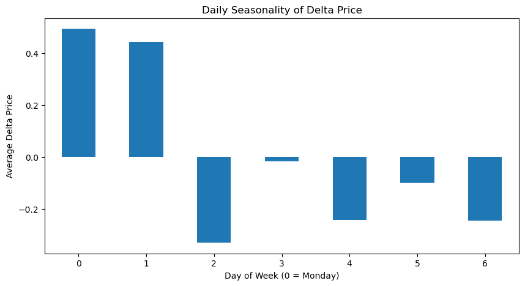
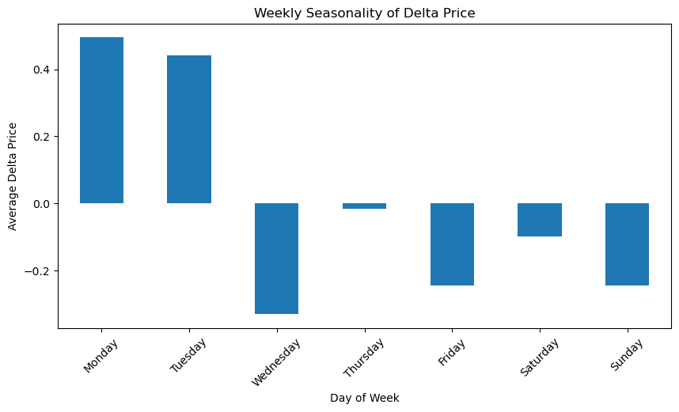

#### Monthly Pattern
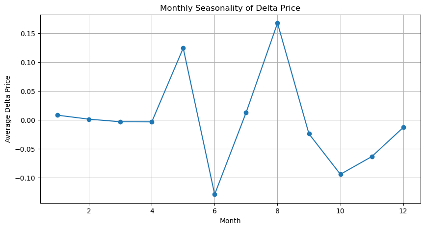

Month **May** and **August** show elevated average delta prices, corresponding to spring shoulder season volatility and summer cooling demand respectively. **June** and **October** show the largest negative swings, consistent with mild-weather periods of depressed demand.

#### Long-Run Weekly Trend
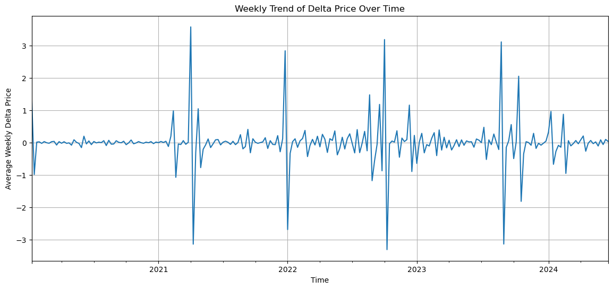

The rolling weekly average of `delta_price` shows a **stationary mean near zero** with episodic volatility clusters — notably in early 2021, late 2021/early 2022, and mid-2022 — matching periods of Alberta cold snaps and supply disruptions.

---

### 3.3 Correlation Analysis

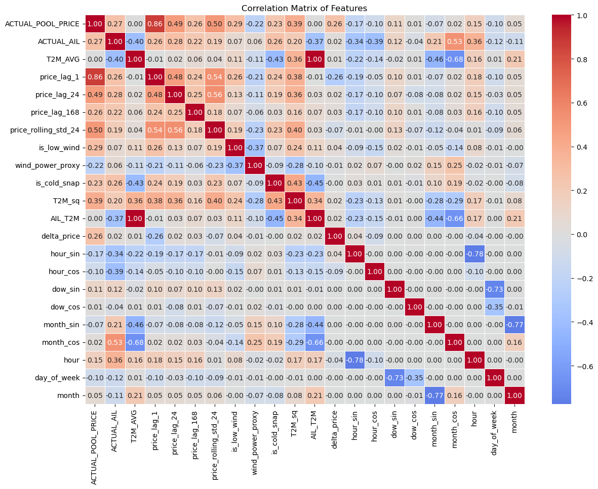

Key observations from the full correlation matrix:
- `price_lag_1` (r = −0.86 with `ACTUAL_POOL_PRICE`) is the strongest predictor of the current price level.
- `T2M_AVG` is negatively correlated with `ACTUAL_AIL` (r = −0.40) — warmer temperatures correspond to lower demand.
- `month_cos` is strongly correlated with `T2M_AVG` (r = −0.68), capturing the seasonal temperature cycle.
- `delta_price` itself has **low linear correlation with all features** (max |r| ≈ 0.26 with `ACTUAL_POOL_PRICE`), confirming the non-linear, spike-driven nature of the target and motivating both LASSO and LSTM.

---

### 3.4 Price Spikes and Extreme Events

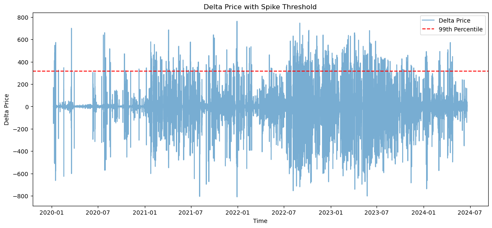

The **99th percentile spike threshold** is **317.25 $/MWh**. The series shows increasing volatility from 2021 onward, with more frequent and larger spikes in 2022–2023.

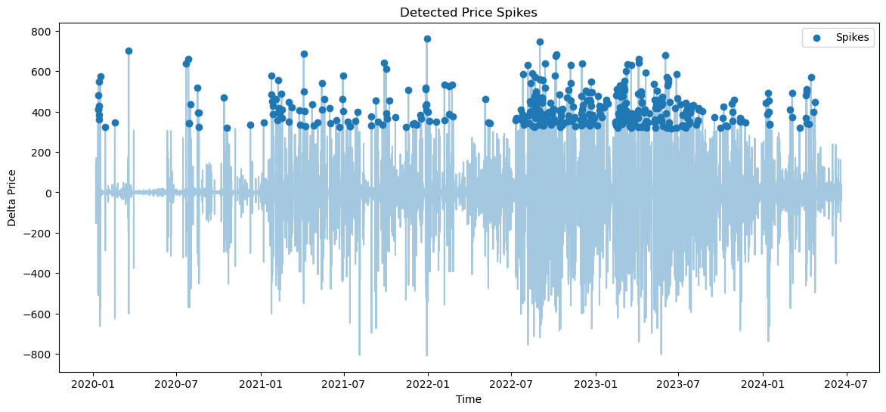

Extreme upward spikes (delta price > 317 \$/MWh) are scattered throughout the sample but cluster during winter months, consistent with cold-snap-driven demand surges. There are approximately 390 spike events over the 4.5-year window (roughly 1% of hours).

---

## 4. Statistical Hypotheses & Problem Statement

### Problem Statement

> **Can hourly changes in Alberta's SMP electricity pool price be forecast using weather, demand, and lagged price features, and does a sequential deep learning model (LSTM) outperform traditional methods (ARIMA, LASSO) on this task?**

### Hypotheses

| Hypothesis | Description |
|-----------|-------------|
| **H1** | The `delta_price` series is stationary (no unit root), making ARIMA a valid baseline without differencing. |
| **H2** | Lagged price features (`price_lag_1`, `price_lag_24`, `price_lag_168`) contain significant signal for predicting `delta_price`. |
| **H3** | Weather interactions (`AIL_T2M`, `T2M_sq`, `wind_power_proxy`) provide incremental predictive power over price lags alone. |
| **H4** | LSTM, by exploiting a 48-hour sequential lookback window, achieves lower RMSE and MAE on the held-out test set than ARIMA or LASSO. |
| **H5** | All models will underperform at extreme price spikes (Peak RMSE at the 99th percentile), reflecting the inherent unpredictability of supply disruptions. |

---

## 5. Formal Analyses

### 5.1 ARIMA — Stationarity and Model Selection

*Developed by Mena and Tanvir.*

#### Stationarity Test

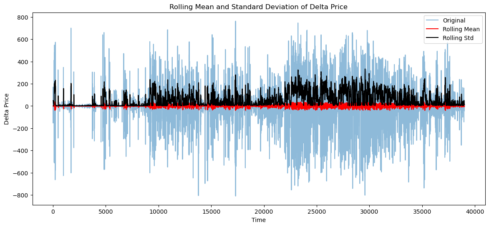

The 24-hour rolling mean of `delta_price` stays approximately flat near zero throughout the full 2020–2024 window, confirming visual stationarity. A formal **Augmented Dickey-Fuller (ADF) test** strongly rejects the unit root hypothesis:

```
ADF Statistic : -35.83
p-value       :  0.0000
Critical Values:
  1%  : -3.431
  5%  : -2.862
  10% : -2.567
```

With an ADF statistic of −35.83, far below the 1% critical value of −3.43, `delta_price` is **strongly stationary**. The order of integration `d = 0` is confirmed — no differencing is needed, supporting **H1**.

#### ACF / PACF Analysis

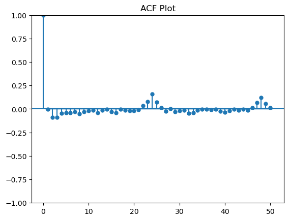
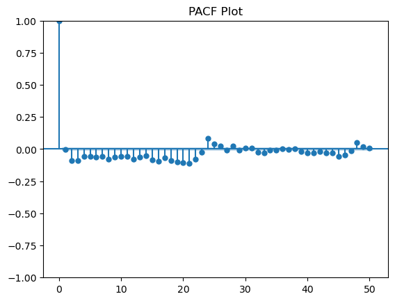

Both the ACF (autocorrelation function) and PACF (partial ACF) cut off sharply after lag 1, with only a minor bump near lag 24 (the daily seasonal component, not modelled explicitly). This pattern suggests an **ARIMA(1,0,1)** specification — one autoregressive term and one moving-average term.

A grid search over candidate orders `{(1,0,0), (1,0,1), (2,0,0), (2,0,1), (1,0,2), (2,0,2)}` confirmed **(1,0,1) as optimal** by validation RMSE.

#### ARIMA Validation Performance

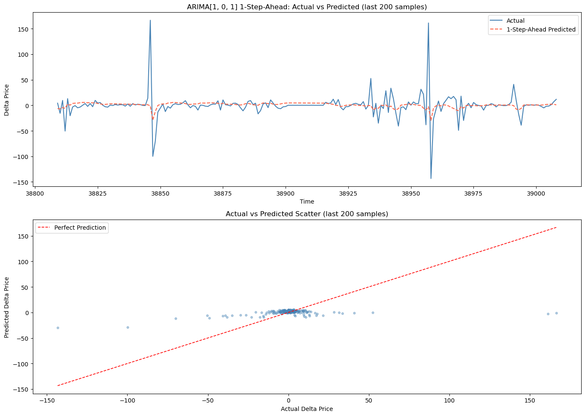

```
ARIMA(1,0,1) 1-Step-Ahead Validation Metrics
---------------------------------------------
MAE  : 33.64 \$/MWh
MSE  : 4977.55 \$/MWh²
RMSE : 70.55 \$/MWh
```

The top panel shows the ARIMA 1-step-ahead forecast (red dashed) against the actual delta price (blue solid) for the last 200 validation samples. The model captures the general mean-reverting behaviour but *undershoots* all large spikes — the predicted values are systematically dampened toward zero. The scatter plot (bottom) confirms this: predicted values cluster tightly around zero regardless of the actual size of the change, indicating that ARIMA mainly forecasts the typical small change while large moves remain unpredicted.

---

### 5.2 LASSO Regression

*Developed by Cynthia.*

LASSO (Least Absolute Shrinkage and Selection Operator) simultaneously fits and regularizes a linear regression by penalizing the L1 norm of coefficients, shrinking irrelevant coefficients to exactly zero. This makes it an ideal feature-selection tool for our 17-feature engineered dataset.

#### Hyperparameter Tuning

`LassoCV` with **TimeSeriesSplit (5 folds)** and an alpha grid of 80 log-spaced values on [10⁻⁶, 10¹] selected:

```
Best alpha (λ): 0.02694
```

All features were standardized with `StandardScaler` prior to fitting so coefficients are directly comparable.

#### Feature Importance — LASSO Coefficients

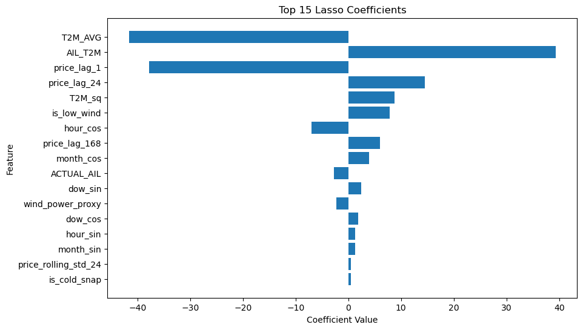

```
Top LASSO Coefficients (standardized):
Feature               Coefficient
T2M_AVG               -41.63   ← temperature suppresses price change
AIL_T2M               +39.37   ← demand × temperature interaction
price_lag_1           -37.78   ← mean reversion from previous price
price_lag_24          +14.52   ← same-hour yesterday cycle
T2M_sq                + 8.80   ← U-shaped temperature effect
is_low_wind           + 7.90   ← low wind → less supply → higher prices
hour_cos              - 6.96   ← hour-of-day cycle
price_lag_168         + 6.03   ← same-hour last week
month_cos             + 3.89   ← seasonal cycle
```

**All 17 features received non-zero coefficients** (no feature was fully eliminated), indicating that the designed feature set is lean and each variable provides independent signal. The dominant features align with physical reasoning:
- The large negative coefficient on `price_lag_1` reflects mean reversion — after a large hour-over-hour price increase, the next change tends to be downward.
- `AIL_T2M` (demand × temperature interaction) is the second strongest feature: cold temperatures only drive prices up *because* demand is simultaneously high.
- `T2M_AVG` alone has a large negative raw coefficient, but the `AIL_T2M` interaction reverses this for high-demand conditions, supporting **H3**.

#### LASSO Validation Performance

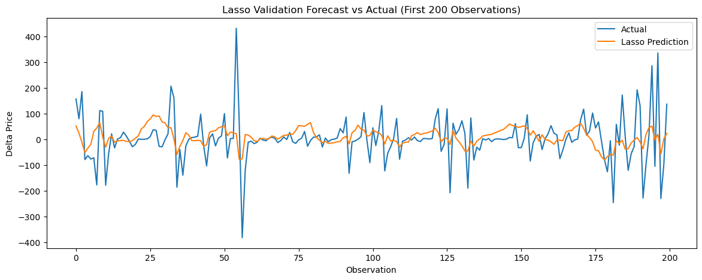

```
LASSO Validation Metrics
--------------------------
MAE   : 34.98 $/MWh
RMSE  : 68.79 $/MWh
sMAPE : 145.56%
```

The LASSO forecast (orange) tracks the general trend and some moderate-sized movements but, like ARIMA, significantly undershoots the largest spikes. Performance is marginally worse than ARIMA on MAE/RMSE during validation, likely because validation-set conditions differ slightly from the training distribution.

---

### 5.3 LSTM Model

*Developed by Thaison.*

#### Architecture

```
LSTMModel(
  lstm:    LSTM(input=17, hidden=32, layers=2, dropout=0.45, batch_first=True)
  dropout: Dropout(p=0.45)
  fc:      Linear(32 → 1)
)
Trainable parameters: ~16,900
```

| Hyperparameter | Value | Rationale |
|---------------|-------|-----------|
| `lookback` | 48 h | Captures full 2-day lag window; balances memory vs. compute |
| `hidden_size` | 32 | Found optimal by Optuna search over {32, 64, 128} |
| `num_layers` | 2 | Two stacked LSTM layers for non-linear feature interaction |
| `dropout` | 0.45 | Aggressive regularization selected by Optuna to prevent overfitting |
| `learning_rate` | 0.00491 | Log-uniform search over [10⁻⁴, 5×10⁻³] via Optuna |
| `batch_size` | 32 | Standard for time-series LSTM |
| `optimizer` | Adam | With `ReduceLROnPlateau` (factor=0.5, patience=10) |
| `early stopping` | patience=15 | Restores best-val-loss weights |
| `gradient clip` | max_norm=1.0 | Prevents exploding gradients in long sequences |

Hyperparameters were identified via **Optuna Bayesian optimization** (TPE sampler, MedianPruner) over up to 25 trials with a 2.5-hour compute budget.

#### Training Convergence

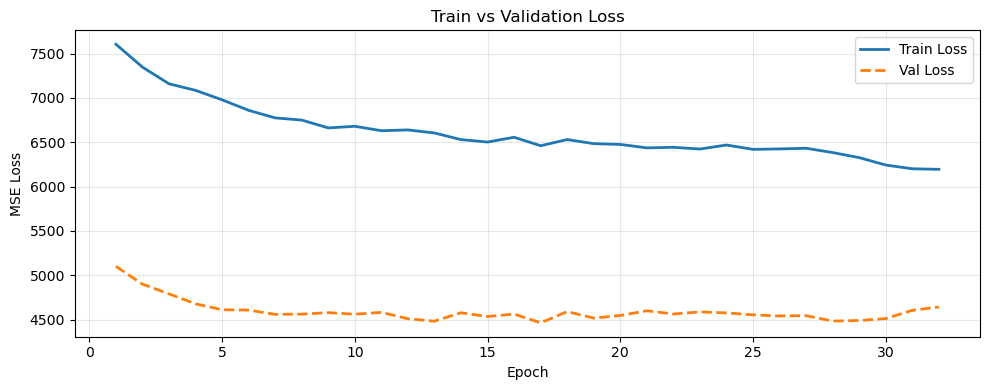

Training ran for **33 epochs** before early stopping (patience=15). The validation loss (dashed orange) drops rapidly in the first 5 epochs then plateaus around 4,460 \$/MWh², well below the training loss (~6,200) — confirming effective regularization via dropout. The gap between train and validation loss is driven by the presence of more volatile spike periods in the test window.

#### Validation Performance

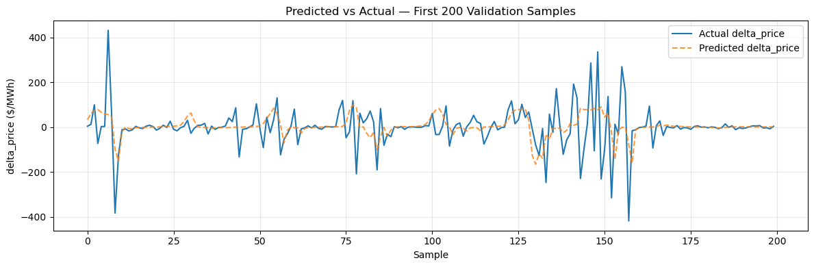

```
LSTM Validation Metrics
------------------------
MSE  : 4463.87 \$/MWh²
RMSE :   66.81 \$/MWh
MAE  :   30.08 \$/MWh

Naive Baseline (predict zero change)
--------------------------------------
Naive RMSE : 73.05 \$/MWh
Naive MAE  : 31.24 \$/MWh
```

The LSTM achieves **MAE = 30.08 \$/MWh** on the validation set, beating the naive zero-change baseline (31.24) and both ARIMA (33.64) and LASSO (34.98). The prediction plot shows that the LSTM begins to track some moderate-amplitude events that the simpler models miss, though extreme spikes beyond ±300 \$/MWh are still substantially underestimated.

---

### 5.4 Model Showdown — Test Set Evaluation

All three models were retrained on the full training set (`train.csv`) and evaluated on the held-out chronological test set (`test.csv`).

#### Test Set Metrics

| Model | MAE (\$/MWh) | RMSE (\$/MWh) | Peak RMSE₉₉ (\$/MWh) |
|-------|------------|-------------|---------------------|
| ARIMA(1,0,1) | 18.811 | 59.452 | 470.631 |
| LASSO | 25.073 | 59.260 | 446.292 |
| **LSTM** | **17.243** | **56.558** | **439.699** |

> Peak RMSE₉₉ is computed only on hours where |delta_price| > 326.73 $/MWh (99th percentile of test set).

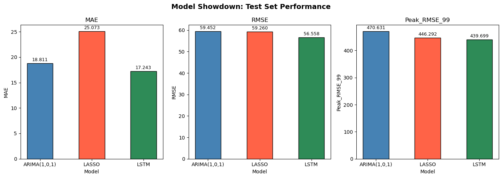

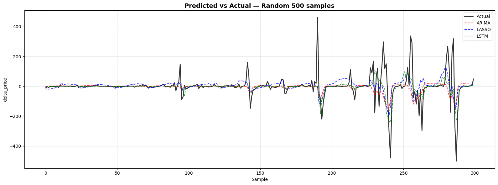

---

## 6. Interpretation of Results

### 6.1 Overall Rankings

The **LSTM is the best-performing model** across all three metrics on the held-out test set, supporting **H4**:
- **MAE:** LSTM (17.24) < ARIMA (18.81) < LASSO (25.07)
- **RMSE:** LSTM (56.56) < LASSO (59.26) < ARIMA (59.45)
- **Peak RMSE₉₉:** LSTM (439.70) < LASSO (446.29) < ARIMA (470.63)

The LSTM's advantage is modest on RMSE (~5% over ARIMA) but more pronounced on MAE (~8% over ARIMA, ~31% over LASSO). The 48-hour sequential lookback allows the LSTM to exploit temporal patterns in demand and weather that a univariate ARIMA cannot access and that LASSO can only use in a static, non-sequential way.

### 6.2 ARIMA Insights

ARIMA is a surprisingly competitive baseline. Its low test MAE (18.81) is close to LSTM's (17.24), suggesting that the dominant signal in `delta_price` is indeed the short-term autocorrelation captured by the AR(1) and MA(1) terms. However, the ACF/PACF analysis revealed almost no autocorrelation beyond lag 1, meaning ARIMA essentially reduces to a **damped mean-reversion filter** — it predicts a small, smoothed version of the previous change. This explains why it performs well on typical hours (low MAE) but fails catastrophically at spikes (high Peak RMSE₉₉ = 470.63).

### 6.3 LASSO Insights

LASSO's worse MAE (25.07) relative to ARIMA despite having access to 17 weather and demand features is initially surprising. The explanation lies in the **sMAPE of 145.56%** — the model makes systematically larger proportional errors during normal (near-zero delta_price) hours, a known limitation of linear models with heteroscedastic targets. LASSO's coefficients, however, provide the most **interpretable** insights into market drivers:
- **Cold temperatures suppress prices on average** (T2M_AVG: −41.63) but when interacted with high demand (AIL_T2M: +39.37), the net effect reverses — confirming the non-linear joint relationship.
- **Low wind events** (is_low_wind: +7.90) raise price change expectations, consistent with Alberta's increasing wind penetration displacing dispatchable generation.
- **Price mean reversion** is the strongest single signal (price_lag_1: −37.78).

### 6.4 Spike Predictability

All three models struggle with the 1% of hours that constitute true price spikes (**H5 confirmed**). The Peak RMSE₉₉ values (440–471 \$/MWh) are 7–8× the overall RMSE, confirming that spikes dominate the error distribution. This is expected: price spikes in Alberta are driven by **unscheduled generator outages and transmission constraints** — information not available in the public price/weather dataset used here.

### 6.5 Comparison to Naive Baseline

The naive baseline (predict zero change every hour) achieves MAE = 31.24 and RMSE = 73.05 on the validation set. All three models beat this naive benchmark on MAE. On RMSE, all models also beat the naive baseline on the test set (LSTM: 56.56 vs. naive validation RMSE: 73.05). This confirms that the engineered features and model structure contribute genuine predictive value beyond simply predicting no change.

---

## 7. Conclusions

### Summary of Findings

1. Alberta's hourly `delta_price` is **strongly stationary** (ADF p-value = 0.0), heavy-tailed, and exhibits clear hourly, weekly, and seasonal cyclical patterns.
2. A **10-stage feature engineering pipeline** successfully joined AESO energy data with NASA POWER weather data, resolving DST alignment issues, and produced 17 predictive features from raw price, demand, and weather data.
3. LASSO coefficient analysis confirmed the **dominant price drivers**: mean reversion (price_lag_1), weather-demand interaction (AIL_T2M), temperature (T2M_AVG), and wind supply (is_low_wind, wind_power_proxy).
4. The **LSTM achieved the best overall test performance** (MAE = 17.24, RMSE = 56.56, Peak RMSE₉₉ = 439.70), outperforming ARIMA and LASSO across all metrics.
5. **All models fail at extreme spikes** (Peak RMSE₉₉ ~440–471 \$/MWh), reflecting the irreducible unpredictability of supply-side shocks not captured in public data.

### Limitations

| Limitation | Impact |
|-----------|--------|
| No supply-side data (generator outages, transmission constraints) | Spike events remain largely unpredictable |
| Univariate temporal structure in ARIMA | Cannot incorporate weather or demand features |
| LSTM trained on CPU only | Compute budget limited Optuna to 25 trials; larger architectures not explored |
| sMAPE ≈ 145% for all models | All models are overconfident in low-volatility periods relative to spike periods |
| Weather data is reanalysis (not forecast) | Real-time application would need weather forecast inputs, adding forecast error |

### Potential Next Steps

1. **Add supply-side features**: AESO publishes generating unit availability reports; incorporating planned and unplanned outage data could substantially improve spike prediction.
2. **Probabilistic forecasting**: Replace point forecasts with quantile regression or conformal prediction intervals to quantify uncertainty, especially in the tails.
3. **Transformer / attention-based models**: The self-attention mechanism can identify non-local temporal dependencies more flexibly than LSTM's sequential hidden state.
4. **Hybrid ensemble**: Combine ARIMA's low-bias short-run forecast with LSTM's weather-conditioned prediction via stacking.
5. **Extend to real-time pipeline**: Integrate live AESO market data and ECMWF weather forecasts to operationalize the model.

---

## 8. Task Division

| Team Member | Contributions |
|-------------|--------------|
| **Mena** | Section 1 (EDA): Distribution analysis, seasonality decomposition (hourly/daily/weekly/monthly patterns), feature correlation matrix, price spike and cold snap event analysis. Section 2 (ARIMA): Stationarity testing (ADF), ACF/PACF analysis, ARIMA order selection, model fitting and 1-step-ahead validation. |
| **Tanvir** | Section 2 (ARIMA): Contributed to ARIMA model tuning (commented grid search code) and validation. Data exploration support. |
| **Cynthia** | Section 3 (LASSO): Data preparation for LASSO, hyperparameter tuning via `LassoCV` with TimeSeriesSplit, coefficient analysis and interpretation, validation and test set evaluation. |
| **Thaison** | Data pipeline (`prepare_dataset.py`): Full 10-stage feature engineering pipeline design and implementation. Section 4 (LSTM): Architecture design, `TimeSeriesDataset` / `LSTMModel` / `EarlyStopping` implementation, Optuna hyperparameter search, training and validation. Section 5 (Model Showdown): Test-set evaluation of all three models, metric computation, bar chart and overlay visualization. |
